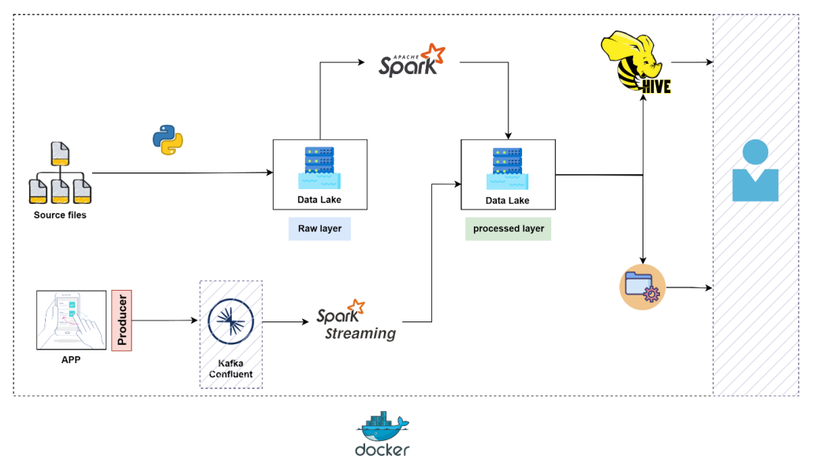
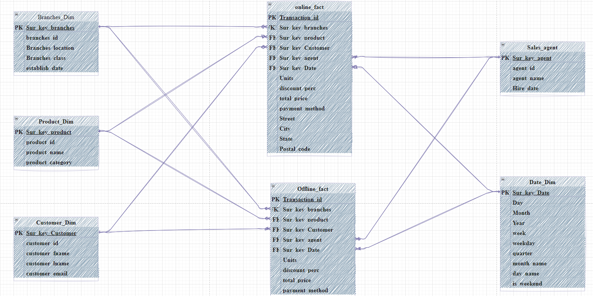

# Retail_pipeline_project

##### [1. Project overview](#project-overview)  
##### [2. Data Modeling](#data-modeling)
##### [3. Batch Part](#batch-part)  
##### [4. Business Requirements](#business-requirements)
##### [5. Data Ingestion Script](#data-ingestion-script)
##### [6. Data Processing for Sales Transaction](#data-processing-for-sales-transaction)
##### [7. Sales Transactions from Silver to Gold](#sales-transactions-from-silver-to-gold)
##### [8. Retail Data Warehouse Dimension Tables](#retail-data-warehouse-dimension-tables)
##### [9. Fact Tables](#fact-tables)
##### [10. Hive Creation](#hive-creation)
##### [11. Streaming part](#streaming-part)
##### [12. Kafka Producer](#kafka-producer)
##### [12. Spark Streaming](#spark-streaming)

## Project overview

### Q Company


Q company, specializing in retail, operates branches across various regions and utilizes an E-commerce platform. In the business day-to-day operations, we may have new products, customers, branches, and salespeople. The company offers multiple offers for customers with a rule for offer redemption: customers can redeem only one offer from regular offers (1-5). Offer discount rates range from 1 to 5 (5 – 10 – 15 – 20 - 25) % from the price.

### Data Nature

The source system pushes 3 files every hour (branches file, sales agents file, sales transactions file). For the sales transactions file, it contains both branches and online sales. The branches and sales agents’ files may contain new entries at any point in time.
***
## Data Modeling


***
## Batch Part

- **Simulate File Ingestion**
  - 6 groups of files, simulate as one group of files comes every hour.
  - Put one group of files every hour in the local file system (LFS), manually or automate it.
  
- **Ingest Files to Data Lake**
  - Files in LFS should be ingested to the data lake as raw files using Python.
  
- **Data Storage and Tracking**
  - As files are pushed every hour to LFS, identify how to store data in the data lake to track it (partitioning).
  
- **Process Files**
  - After ingesting raw files in the data lake, process these files to meet business requirements.
  - Store processed files in the data lake as Hive tables to serve as the Data Warehouse (DWH) using Spark.
  
- **Data Cleaning**
  - Ensure data is cleaned well.
  
- **Business Insights**
  - Provide required business insights (details to be covered later).
***
## Business Requirements

- Represent the business team, read the data carefully, and build your own DWH model considering the remaining requirements.
- Most query conditions will use transaction date.
- Add a column in the fact table for the total paid price after discount.
- Marketing team requirements:
  - Identify the most selling products.
  - Determine the most redeemed offers by customers.
  - Determine the most redeemed offers per product.
  - Identify the lowest cities in online sales to run more campaigns.
- B2B team requirements:
  - Provide a daily CSV file containing sales_agent_name, product_name, and total_sold_units.
  - Send this file to the local file system.
***
## Data Ingestion Script

This script automates processing directories and files in the local filesystem for upload to Hadoop Distributed File System (HDFS). It renames files and keeps track of completed directories to prevent redundant processing.

### Script Overview

1. **List Directories:** Identifies all directories starting with "group" in a designated local path.
2. **Filter Processed Directories:** Excludes directories already processed based on a tracking file.
3. **Rename and Upload Files:**
    - Renames files within the chosen directory by appending the current date and hour.
    - Uploads renamed files to a structured HDFS location.
4. **Record Processed Directory:** Adds the processed directory name to the tracking file to avoid re-processing.

### Required Libraries

* `os`: Provides functions for interacting with the operating system.
* `datetime`: Offers classes for working with dates and times.
* `pydoop.hdfs`: Enables interaction with HDFS.
* `re`: Allows the use of regular expressions (not used in this specific script).

### Directory Listing and Filtering

**Listing Directories**

```python
dirs = os.listdir('/home/itversity/itversity-material/retail_pipeline/data')
groups = [d for d in dirs if os.path.isdir(os.path.join('/home/itversity/itversity-material/retail_pipeline/data', d)) and d.startswith('group')]
print(groups)
```

**Reading Already Processed Directories**

```python
with open('/home/itversity/itversity-material/retail_pipeline/data/written_groups.txt', 'r') as file:
    skip_dir = file.read().splitlines()
```

**Filtering New Directories**

```python
filtered_dir = [group for group in groups if group not in skip_dir]
if filtered_dir:
    files = os.listdir(f"/home/itversity/itversity-material/retail_pipeline/data/{filtered_dir[0]}")
else:
    print("No new directories to process.")
```

### Renaming Files and Uploading to HDFS

**`rename_files_and_upload` Function**

```python
def rename_files_and_upload(local_directory, hdfs_directory):
    for file_name in files:
        # ... (code to rename and upload files)
```

This function iterates through files, renames them with timestamps, creates necessary HDFS directories, and uploads the renamed files.

### Recording Processed Directories

**`write_dirs_to_file` Function**

```python
def write_dirs_to_file(file_path, group):
    # ... (code to record processed directory)
```

This function adds a directory name to a tracking file if it's not already listed.

**Recording the Processed Directory**

```python
write_dirs_to_file('/home/itversity/itversity-material/retail_pipeline/data/written_groups.txt', filtered_dir[0])
```

### Detailed Explanation

The script follows these steps:

1. Lists all directories in the specified local path.
2. Filters out previously processed directories.
3. If new directories exist:
    - Renames files with timestamps within the chosen directory.
    - Uploads renamed files to an organized HDFS location.
4. Records the processed directory name to prevent future re-processing.

This approach ensures only new directories are processed, files are renamed with timestamps for organization, and uploads are structured within HDFS.
***
## Data Processing for Sales Transaction

### Data Reading

* **Input Data:** Reads Parquet data from a specified path in the HDFS bronze layer.
* **Timeframe:** Targets data for the current date and hour.

### Data Cleaning

* **Email Cleaning:**
    * Removes special characters from the `customer_email` column.
    * Replaces ".comm" with ".com" in the `customer_email` column (assuming typos).

* **Discount Calculation:**
    * Computes a new column named `discount_perc` based on the presence/absence of values in boolean offer columns (`offer_1` to `offer_5`).

### Data Transformation

* **Column Handling:**
    * Drops unnecessary columns: 
        * `cleaned_email` (likely created during cleaning)
        * `customer_email` (original column, potentially after cleaning)
    * Renames column: `cusomter_lname` to `customer_lname` (fixing typo)

### Data Writing

* **Output:** Writes the modified DataFrame to the silver layer in HDFS for the current date and hour.

### File Management

* **File Listing:** Uses the `subprocess` module to list files in the silver layer directory.
* **Error Handling:**
    * Checks for errors during file listing.
    * Prints error messages if encountered.

* **File Renaming:**
    * Renames the first file listed in the directory.
    * Uses `subprocess` to execute Hadoop file system commands for renaming based on information from the cleaned data.
***

## Sales Transactions from Silver to Gold
## Processing Sales Transactions

This code implements a Spark job to process sales transaction data. It reads data from a parquet file in HDFS, performs transformations, and writes the results to a Hive table.

### Dependencies

The code utilizes the following libraries:

* `pyspark.sql`: Provides functionalities for working with DataFrames in Spark SQL.
* `functools`: Offers functions for working with higher-order functions.
* `datetime`: Provides classes for representing dates and times.
* `subprocess`: Enables executing shell commands from Python.
* `py4j.java_gateway`: Facilitates communication between Python and the Java Virtual Machine (JVM).
* `os`: Offers functions for interacting with the operating system.

### Spark Session Configuration

The code first initializes a Spark session using `SparkSession.builder`. Here's a breakdown of the configuration options used:

* `master("local[4]")`: Sets up a local Spark cluster with 4 cores.
* `appName("sales_transactions")`:  Names the Spark application for better identification.
* `config("spark.eventLog.logBlockUpdates.enabled", True)`: Enables logging of block updates for debugging purposes.
* `enableHiveSupport()`: Activates Hive support for interacting with Hive tables.

### Utility Functions

* `rename_in_hdfs(golden_layer_path, file_extension, name)`: 
    * This function helps rename files in HDFS based on specific criteria.
    * It utilizes `subprocess.run` to execute the `hadoop fs -ls` command and retrieve file listings.
    * It searches for a file with the provided extension and renames it to the specified `name` within the `golden_layer_path`.
* `check_if_exists(path)`:
    * This function verifies if a file exists in the specified `path` within HDFS.
    * It leverages the Spark JVM (`_jvm`) and Java Gateway (`_jsc`) to access the Hadoop file system and check for the file's existence.

### Data Processing Logic

1. **Get Current Date and Hour**: 
    * The script retrieves the current date and hour using `datetime.now()` and formats them for later use.

2. **Read Input Data**:
    * `spark.read.parquet` is used to read the sales transaction data from a parquet file located at `hdfs:///data/retail_silver/{date_str}/{hour_str}/sales_transactions_SS_cleaned_{date_str}_{hour_str}.parquet`.
    * The path incorporates dynamic variables (`date_str` and `hour_str`) to ensure reading the latest data based on the current date and hour.

3. **Write DataFrame to Hive Table**:
    * The `write_df_to_table` function offers a reusable approach to write DataFrames to Hive tables.
    * It takes arguments for the database name, table name, DataFrame, optional partition columns, and bucketing configuration.
    * The function creates a temporary table, saves the DataFrame to the temporary table using `writer.saveAsTable`, and constructs an `INSERT OVERWRITE` query that inserts data into the target Hive table.
    * Finally, it drops the temporary table using `subprocess.run` after the data is successfully inserted.

***
## Retail Data Warehouse Dimension Tables

This document describes the schema and process for creating and managing dimension tables in the retail data warehouse. Dimension tables provide detailed information about specific entities within the data warehouse, allowing for efficient analysis and querying.

### Dimensions

The following dimension tables are currently implemented:

* **Customer Dimension (customer_dim.parquet)**: Stores information about customers, including:
    * `customer_sur_key (int)`: Unique surrogate key for the customer.
    * `customer_id (string)`: The original customer identifier from the source system.
    * `customer_fname (string)`: Customer's first name.
    * `customer_lname (string)`: Customer's last name.
    * `customer_email (string)`: Customer's email address (optional).

* **Product Dimension (product_dim.parquet)**: Stores information about products, including:
    * `product_sur_key (int)`: Unique surrogate key for the product.
    * `product_id (string)`: The original product identifier from the source system.
    * `product_name (string)`: Name of the product.
    * `product_category (string)`: Category of the product.

* **Branch Dimension (branches_dim.parquet)**: Stores information about branches, including:
    * `branch_sur_key (int)`: Unique surrogate key for the branch.
    * `branch_id (string)`: The original branch identifier from the source system.
    * `location (string)`: Location of the branch.
    * `establish_date (date)`: Date the branch was established.
    * `class (string)`: Classification of the branch (optional).

* **Sales Agent Dimension (sales_agent_dim.parquet)**: Stores information about sales agents, including:
    * `sales_agent_sur_key (int)`: Unique surrogate key for the sales agent.
    * `sales_person_id (string)`: The original sales agent identifier from the source system.
    * `name (string)`: Name of the sales agent.
    * `hire_date (date)`: Date the sales agent was hired.

* **Date Dimension (date_dim.parquet)**: Stores information about dates, including:
    * `date_sur_key (long)`: Unique surrogate key for the date.
    * `datee (date)`: The actual date.
    * `year (int)`: Year of the date.
    * `month (int)`: Month of the date (1-12).
    * `day (int)`: Day of the month (1-31).
    * `week (int)`: Week of the year (1-52).
    * `weekday (int)`: Day of the week (1=Sunday, 7=Saturday).
    * `quarter (int)`: Quarter of the year (1-4).
    * `day_name (string)`: Full name of the weekday (e.g., Monday).
    * `month_name (string)`: Full name of the month (e.g., January).
    * `is_weekend (int)`: Flag indicating if the date is a weekend (1) or weekday (0).

**Data Loading Process**

The code utilizes a similar approach for loading and updating each dimension table. Here's a general overview:

1. **Read Input Data**: Selects relevant columns from the input DataFrame based on the specific dimension table.
2. **Identify Duplicates**: Removes duplicate records based on a unique identifier (e.g., `customer_id` for customer dimension).
3. **Check for Existing Data**: Verifies if the dimension table already exists in HDFS.
4. **Identify New Data**: If the table exists, it subtracts existing data (excluding the surrogate key) from the new data to find new entries.
5. **Assign Surrogate Keys**: If new data is found, it retrieves the maximum existing surrogate key value and assigns new sequential keys to the new entries.
6. **Combine and Write Data**: Combines the existing data with the newly identified entries and writes the entire DataFrame back to HDFS in Parquet format using overwrite mode.
7. **Write to Hive Table**: Optionally writes the data to a corresponding Hive table for further analysis using SQL queries.

The provided code defines two fact tables for the retail data warehouse: `offline_fact` and `online_fact`. Here's how they can be described following the structure of the dimension tables outlined in the document:

***

## Fact Tables

* **Offline Fact Table (offline_fact.parquet)**
    * **Description**: Stores information about offline transactions, including transaction details and foreign keys for joining with dimension tables. 
    * **Columns**:
        * `transaction_id (string)`: Unique identifier for the transaction.
        * `branch_sur_key (int)`: Foreign key referencing the `branch_sur_key` in the `branches_dim.parquet` table.
        * `product_sur_key (int)`: Foreign key referencing the `product_sur_key` in the `product_dim.parquet` table.
        * `customer_sur_key (int)`: Foreign key referencing the `customer_sur_key` in the `customer_dim.parquet` table (can be null for anonymous purchases).
        * `sales_agent_sur_key (int)`: Foreign key referencing the `sales_agent_sur_key` in the `sales_agent_dim.parquet` table (can be null if not applicable).
        * `date_sur_key (long)`: Foreign key referencing the `date_sur_key` in the `date_dim.parquet` table.
        * `units (int)`: Number of units purchased.
        * `unit_price (double)`: Price per unit of the product.
        * `discount_perc (int)`: Discount percentage applied to the transaction.
        * `total_price (double)`: Calculated total price after applying discounts (units * unit_price * (1 - discount_perc / 100)).
        * `payment_method (string)`: Method of payment used for the transaction.

* **Online Fact Table (online_fact.parquet)**
    * **Description**: Stores information about online transactions, including transaction details, foreign keys for joining with dimension tables, and additional details specific to online orders.
    * **Columns**:
        * `transaction_id (string)`: Unique identifier for the transaction.
        * `units (int)`: Number of units purchased.
        * `unit_price (double)`: Price per unit of the product.
        * `payment_method (string)`: Method of payment used for the transaction.
        * `discount_perc (int)`: Discount percentage applied to the transaction.
        * `total_price (double)`: Calculated total price after applying discounts (units * unit_price * (1 - discount_perc / 100)).
        * `customer_sur_key (int)`: Foreign key referencing the `customer_sur_key` in the `customer_dim.parquet` table (can be null for anonymous purchases).
        * `product_sur_key (int)`: Foreign key referencing the `product_sur_key` in the `product_dim.parquet` table.
        * `date_sur_key (long)`: Foreign key referencing the `date_sur_key` in the `date_dim.parquet` table.
        * `street (string)`: Street address from the shipping address.
        * `city (string)`: City from the shipping address.
        * `state (string)`: State from the shipping address.
        * `postal_code (string)`: Postal code from the shipping address.

**Data Loading Process**

The code has a similar approach for loading and updating both fact tables. It involves:

1. Filtering the input DataFrame based on the transaction type (online/offline).
2. Performing data cleaning and transformation steps like:
    * Removing duplicates.
    * Identifying new entries by comparing with existing data.
    * Assigning surrogate keys for new entries.
    * Calculating additional columns like `total_price`.
3. Joining the processed data with relevant dimension tables on foreign keys.
4. Selecting a specific set of columns for the final fact table schema.
5. Writing the processed data to Parquet format in HDFS, handling potential updates and new data efficiently.
6. Optionally, writing the data to a Hive table for further analysis using SQL queries.
***
## Hive Creation

### Dimension Tables

#### Customer Dimension

- **Staging Table:**
  - External table (`Customer_Dim_staging`) reads from the golden layer.
  - Stored as Parquet format.

- **Final Table:**
  - External table (`Customer_Dim`) reads from the golden layer.
  - Stored as ORC format.

#### Product Dimension

- **Staging Table:**
  - External table (`Product_Dim_staging`) reads from the golden layer.
  - Stored as Parquet format.

- **Final Table:**
  - External table (`Product_Dim`) reads from the golden layer.
  - Stored as ORC format.

#### Branches Dimension

- **Staging Table:**
  - External table (`Branches_Dim_staging`) reads from the golden layer.
  - Stored as Parquet format.

- **Final Table:**
  - External table (`Branches_Dim`) reads from the golden layer.
  - Stored as ORC format.

#### Sales Agents Dimension

- **Staging Table:**
  - External table (`sales_agents_Dim_staging`) reads from the golden layer.
  - Stored as Parquet format.

- **Final Table:**
  - External table (`sales_agents_Dim`) reads from the golden layer.
  - Stored as ORC format.

#### Date Dimension

- **Staging Table:**
  - External table (`date_Dim_staging`) reads from the golden layer.
  - Stored as Parquet format.

- **Final Table:**
  - External table (`date_Dim`) reads from the golden layer.
  - Partitioned by `year`.
  - Stored as ORC format.

### Fact Tables

#### Branches Transaction Fact Table

- **Staging Table:**
  - External table (`branches_TRX_fact_staging`) reads from the golden layer.
  - Stored as Parquet format.

- **Final Table:**
  - External table (`branches_TRX_fact`) reads from the golden layer.
  - Partitioned by `payment_method`.
  - Stored as ORC format.

#### Online Transaction Fact Table

- **Staging Table:**
  - External table (`online_TRX_fact_staging`) reads from the golden layer.
  - Stored as Parquet format.

- **Final Table:**
  - External table (`online_TRX_fact`) reads from the golden layer.
  - Partitioned by `payment_method`.
  - Stored as ORC format.

### Storage Locations

- **Staging Tables Location:** All staging tables are stored in `hdfs:///data/retail_gold/`.
- **Final Tables Location:** Final dimension and fact tables are stored under the `retail_DWH` database in Hive.

***
## Streaming part

### Technical Description

- **Data Source:**
  - App logs are generated dynamically by a Kafka Python producer.
  - The schema of the logs is dynamic and varies based on the data generating part of the producer.

- **Kafka Producer Setup:**
  - Configure and start the Kafka Python producer to send logs to a Kafka cluster.
  - Example command to run the producer in the background:
    ```
    python /script/location/script.py
    ```
  - Alternatively, the producer can be executed from a Jupyter notebook environment.

- **Spark Streaming Job:**
  - Develop a Spark streaming job to consume data from Kafka.
  - Process the incoming log data in real-time.
  - Store the processed data onto HDFS for further analysis and batch processing.

## Considerations

- **Dynamic Schema Handling:**
  - Implement schema detection and adaptation in the Spark streaming job to handle the dynamic nature of log schemas.
  
- **Fault Tolerance:**
  - Configure fault-tolerant mechanisms in Spark streaming to handle any processing failures and ensure data integrity.
***
## Kafka Producer

### Dependencies

* `confluent-kafka`: Python library for interacting with Apache 
* `json`: Python library for working with JSON data
* `time`: Python library for working with time-related functionalities
* `random`: Python library for generating random numbers 

### Configuration

The script utilizes a dictionary named `conf` to define producer configuration details:

* `bootstrap.servers`: The address of the Confluent Cloud Kafka cluster.
* `security.protocol`: Security protocol used for communication (SASL_SSL in this case).
* `sasl.mechanisms`: Authentication mechanism (PLAIN here).
* `sasl.username`: Username for Confluent Cloud access.
* `sasl.password`: Password for Confluent Cloud access 

```python
conf = {
    'bootstrap.servers': '****',
    'security.protocol': '****',
    'sasl.mechanisms': '****',
    'sasl.username': '****',
    'sasl.password': '****',
}
```

**Note:** Replace the placeholder values for `sasl.username` and `sasl.password` with your actual Confluent Cloud credentials.

### Topic Name

The script defines a variable `topic` to specify the Kafka topic name where events will be produced.

```python
# add topic_name here 
topic = '' # add topic name
```

### Event Generation (`generate_event` function)

The `generate_event` function takes an `event_type` string as input and returns a dictionary representing a customer event. 

* The event dictionary includes common fields like `eventType`, `customerId`, `productId`, `timestamp`, and `metadata`.
* The `metadata` field can contain additional details specific to the event type.
* The function populates additional fields based on the provided `event_type`:
    * `productView`: Adds `category` and `source` to `metadata`.
    * `addToCart`: Includes `quantity`.
    * `purchase`: Adds `quantity`, `totalAmount`, and `paymentMethod`.
    * `recommendationClick`: Includes `recommendedProductId` and `algorithm`.

### Event Producer (`Producer` object)

The script creates a `Producer` object from the `confluent_kafka.Producer` class using the configuration dictionary `conf`. This object is responsible for sending events to the Kafka topic.

### Sending Events (`send_event` function)

The `send_event` function takes an event dictionary as input and attempts to send it to the Kafka topic:

* It converts the event dictionary to a JSON string using `json.dumps`.
* The function uses the producer object's `produce` method to send the JSON data to the specified topic.
* Upon successful production, the function prints a confirmation message with the event details.
* Any exceptions encountered during production are caught and printed as errors.

### Main Loop (`main` function)

The `main` function runs continuously:

* It randomly selects an `event_type` from a predefined list.
* It calls `generate_event` to create a corresponding event object.
* The event details are printed for reference.
* The `send_event` function is called to send the event to Kafka.
* The script introduces a random sleep between events using `time.sleep` to simulate real-world event generation patterns.

### Running the Script

1. Ensure you have the required libraries installed (`confluent-kafka`, `json`, `time`, `random`).
2. Replace the placeholder values in `conf` with your Confluent Cloud credentials.
3. Set the desired topic name in the `topic` variable.
4. Run the script using Python (`python producer.py`).
***
## Spark Streaming

**Kafka Connection Details:**

```python
bootstrap_servers = "****"
kafka_topic = "***" # add topic name
kafka_username = "****"
kafka_password = "****"
```

This section defines essential details for connecting to the Kafka cluster:

* **`bootstrap_servers`**: This variable stores the address of the Kafka bootstrap server, which acts as the entry point for connecting to the Kafka cluster.
* **`kafka_topic`**: This specifies the name of the Kafka topic from which the streaming data will be consumed.
* **`kafka_username` and `kafka_password`**: These variables hold the credentials for secure access to the Kafka topic. 
  * **Note:** Avoid storing sensitive information like passwords directly in code. Consider environment variables.

**Define JSON Schema:**

```python
schema = StructType() \
  .add("eventType", StringType()) \
  .add("customerId", StringType()) \
  .add("productId", StringType()) \
  .add("timestamp", TimestampType()) \
  .add("metadata", StructType()
      .add("category", StringType())
      .add("source", StringType())
  ) \
  .add("quantity", IntegerType()) \
  .add("totalAmount", FloatType()) \
  .add("paymentMethod", StringType()) \
  .add("recommendedProductId", StringType()) \
  .add("algorithm", StringType())
```

This code snippet defines the schema for the incoming JSON data. A schema acts as a blueprint, specifying the expected structure and data types of each field within the JSON objects received from the Kafka topic.

**Read Stream from Kafka:**

```python
df = spark \
  .readStream \
  .format("kafka") \
  .option("kafka.bootstrap.servers", bootstrap_servers) \
  .option("subscribe", kafka_topic) \
  .option("startingOffsets", "earliest") \
  .option("kafka.security.protocol", "SASL_SSL") \
  .option("kafka.sasl.mechanism", "PLAIN") \
  .option("kafka.sasl.jaas.config",
      f'org.apache.kafka.common.security.plain.PlainLoginModule required username="{kafka_username}" password="{kafka_password}";') \
  .load()
```

This section configures a Spark Streaming DataFrame to continuously read data from the specified Kafka topic.

- **format("kafka")**: Specify Kafka as the data source.
- **option("kafka.bootstrap.servers", bootstrap_servers)**: Set the Kafka broker address.
- **option("subscribe", kafka_topic)**: Specify the topic to subscribe to.
- **option("startingOffsets", "earliest")**: Read data from the beginning of the topic.
- **option("kafka.security.protocol", "SASL_SSL")**: Use SASL_SSL for security.
- **option("kafka.sasl.mechanism", "PLAIN")**: Use the PLAIN mechanism for SASL.
- **option("kafka.sasl.jaas.config", ...)**: Provide the Kafka credentials.

### Process JSON Data

```python
json_df = df.selectExpr("CAST(value AS STRING)").select(from_json("value", schema).alias("data")).select("data.*")
```
Convert the Kafka value column from binary to string, parse it as JSON, and select the individual fields defined in the schema.

### Write Data to HDFS

```python
query = json_df \
  .writeStream \
  .outputMode("append") \
  .format("parquet") \
  .option("path", "hdfs://localhost:9000/data/streaming/streaming-output") \
  .option("checkpointLocation", "hdfs://localhost:9000/data/streaming/checkpoint") \
  .start()
```

- **outputMode("append")**: Append the new data to the existing dataset.
- **format("parquet")**: Write the data in Parquet format.
- **option("path", "hdfs://your-hdfs-path/streaming-output")**: Specify the output path in HDFS.
- **option("checkpointLocation", "hdfs://your-hdfs-path/checkpoint")**: Specify the checkpoint location in HDFS.
- **start()**: Start the streaming query.

### Monitoring and Stopping the Query

The streaming query will run continuously, processing new data as it arrives. To stop the query, you can use:

```python
query.awaitTermination()
```

or stop it manually with:

```python
query.stop()
```

